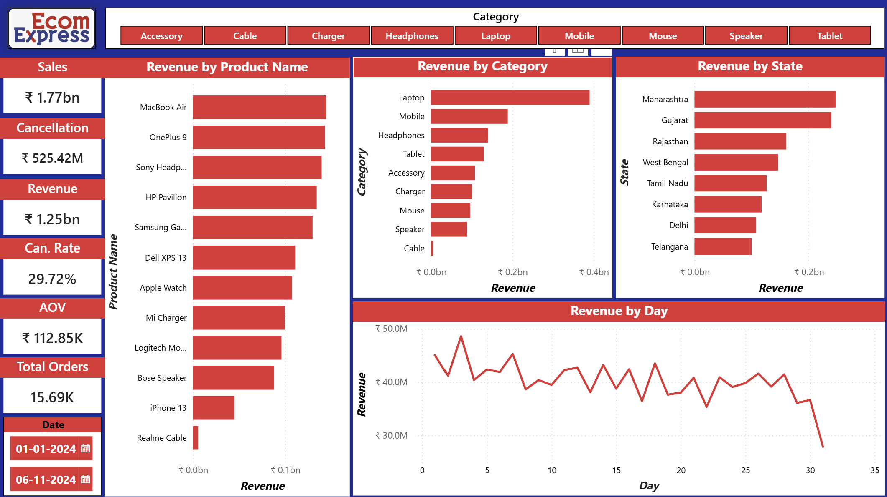

# 📊 Ecom Express Delivery Dashboard

Interactive Business Intelligence dashboard built using **Power BI**, **Power Query**, and **DAX** to analyze E-commerce delivery performance through interactive visualizations and key business metrics.

---

## 📌 Project Overview

This project focuses on analyzing E-commerce delivery operations to help stakeholders monitor order performance, delivery efficiency, revenue trends, and operational KPIs through an interactive Power BI dashboard.

The dashboard enables users to explore the data dynamically using filters and visualizations, making business insights easier to understand and act upon.

---

## 🛠️ Tech Stack

- Microsoft Power BI
- Power Query
- DAX (Data Analysis Expressions)
- CSV Dataset

---

## 📈 Dashboard Features

- 📊 KPI Cards
- 📦 Order Performance Analysis
- 🚚 Delivery Status Analysis
- 📈 Interactive Charts
- 🎯 Dynamic Slicers
- 📉 Business Insights

---

## 🖼️ Dashboard Preview



---

## 📊 Key Performance Indicators (KPIs)

- Total Orders
- Total Revenue
- Total Profit
- Average Delivery Time
- Delivery Success Rate

---

## 📈 Dashboard Insights

- Analyze delivery performance across different regions.
- Monitor order volume and revenue trends.
- Compare delivery status using interactive filters.
- Identify product performance across different categories.
- Track business KPIs for operational decision-making.

---

## 🚀 Skills Demonstrated

- Data Cleaning using Power Query
- Data Modeling
- DAX Measure Creation
- KPI Development
- Interactive Dashboard Design
- Business Intelligence Reporting
- Data Visualization

---

## 📂 Repository Structure

```text
Ecom-Express-Delivery-Dashboard
│
├── README.md
├── Dashboard.png
├── Ecom_Express_BI_Dashboard.pbix
├── assets
│   └── ecomm_express_logo.png
└── Ecommerce (CSV Files)
    ├── Customers.csv
    ├── Orders.csv
    └── Products.csv
```

---

## 📁 Dataset

The project uses an E-commerce sales dataset containing:

- Customer Information
- Product Details
- Order Details
- Delivery Information

The dataset was transformed and modeled using **Power Query** before creating the dashboard.

---

## 🎯 Learning Outcomes

Through this project, I gained hands-on experience in:

- Building interactive Power BI dashboards
- Writing DAX measures for business KPIs
- Transforming data using Power Query
- Creating professional business reports
- Designing dashboards for data-driven decision making

---

## 👨‍💻 Author

**Om Dattatray Kumbhar**

- GitHub: https://github.com/kumbharom1519
